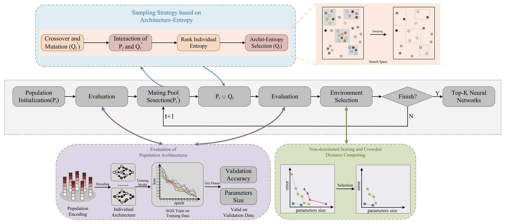
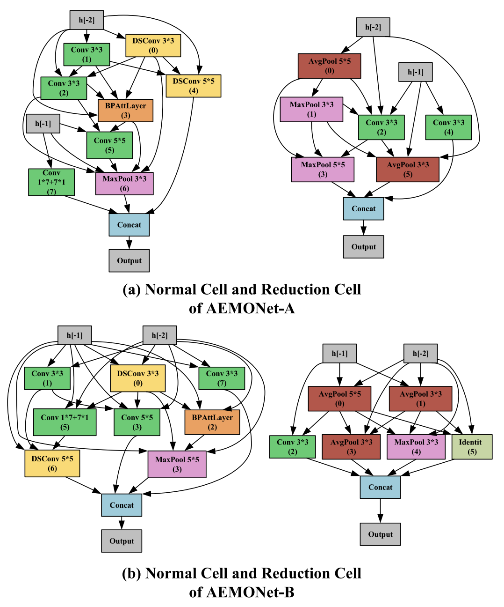

### Architecture entropy sampling-based evolutionary neural architecture search and its application in osteoporosis diagnosis



***

The code in this repository implements AEMONAS, a method accepted by Complex & Intelligent Systems (CAIS). <font color='red'>This is the first neural architecture search approach applied to the task of osteoporosis diagnosis.</font>

#### Introduction
In recent years, neural architecture search (NAS) has achieved unprecedented development because of its ability to automatically achieve high-performance neural networks in various tasks. Among these, the evolutionary neural architecture search (ENAS) has impressed the researchers due to the excellent heuristic exploration capability. 

However, the evolutionary algorithm-based NAS are prone to the loss of population diversity in the search process, causing that the structure of the surviving individuals is exceedingly similar, which will lead to premature convergence and fail to explore the search space comprehensively and effectively. 

To address this issue, we propose a novel indicator, named architecture entropy, which is used to measure the architecture diversity of population. Based on this indicator, an effective sampling strategy is proposed to select the candidate individuals with the potential to maintain the population diversity for environmental selection. In addition, an unified encoding scheme of topological structure and computing operation is designed to efficiently express the search space, and the corresponding population update strategies are suggested to promote the convergence. The experimental results on several image classification benchmark datasets CIFAR-10 and CIFAR-100 demonstrate the superiority of our proposed method over the state-of-the-art comparison ones. To further validate the effectiveness of our method in real applications, our proposed NAS method is applied in the identification of lumbar spine X-ray images for osteoporosis diagnosis, and can achieve a better performance than the commonly used methods.

***



#### Dependencies
* python 3.8
* pytorch 1.8
* numpy
* pandas
* sklearn

#### Usage
```
python3 AEMO_Main.py 
```

#### References

* MFENAS: https://github.com/DevilYangS/MFENAS

#### BibTex
If you find this work and the code helpful to your research, please kindly consider citing our paper. Thanks!

```
@article{chu2023architecture,
  title={Architecture entropy sampling-based evolutionary neural architecture search and its application in osteoporosis diagnosis},
  author={Chu, Jianjun and Yu, Xiaoshan and Yang, Shangshang and Qiu, Jianfeng and Wang, Qijun},
  journal={Complex \& Intelligent Systems},
  volume={9},
  number={1},
  pages={213--231},
  year={2023},
  publisher={Springer}
}
```
